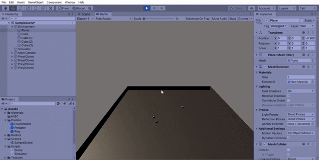
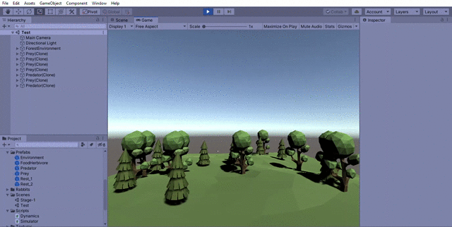
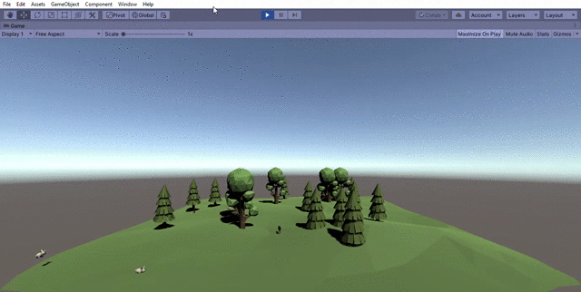

# Predator-Prey-Dynamics
## Summary
This is part of a bigger evolution simulation project but here the predator-prey dynamics are being investigated independently.
## Lotka-Volterra Equations
Predator–Prey equations, are a pair of first-order nonlinear differential equations, frequently used to describe the dynamics of biological systems in which two species interact, one as a predator and the other as prey. The populations change through time according to this pair of equations.

## Objective
### Stage 1 
Introduce genes for evolution and implement a basic genetic algorithm based evolution.
### Working Demonstrations
#### Dynamics Setup Completed

#### Environment Setup Completed

#### Predators are now spawned with speed controlled by genes after generations of Genetic Recombination 

# Experiment 1
### AIM 
#### Test different population sizes and population characteristics
### Result 
#### With more prey the average speed of the predators increased over time as expected.
#### With more predators or less prey the speed decreased over time which was not expected.
